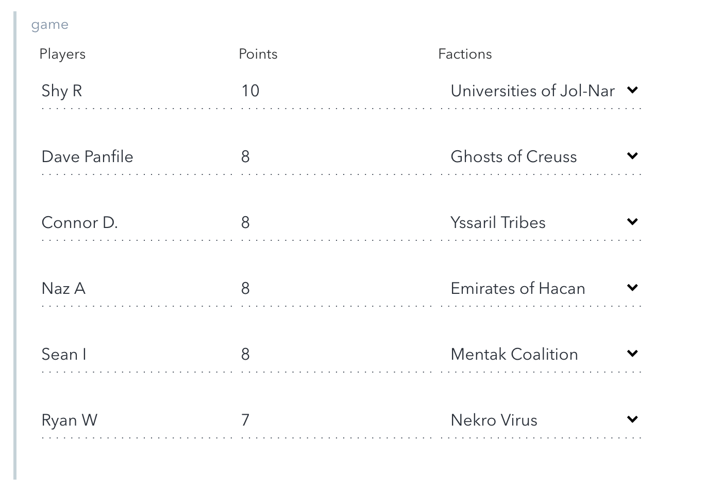
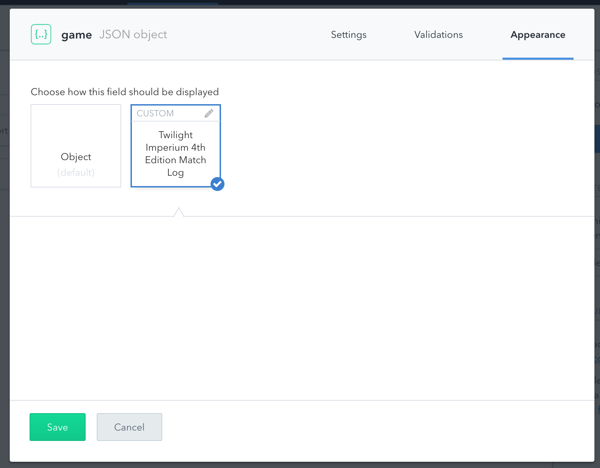

# ti4.nyc-ui-extension
Contentful UI Extension for tracking games of Twilight Imperium Fourth edition (ti4) played for the ti4.nyc website.

## How it Works

This UI extension creates a form that'll collect names, factions and scores for 6 players. It'll prepopulate the faction dropdown with all the of the races from the game. Contentful will store the results of that field as a [JSON type](https://www.contentful.com/developers/docs/concepts/data-model/).

## Description

You can install this extension into your Contentful space via the [Contentful Comand line tool](https://github.com/contentful/contentful-cli) or by utilizing the inbrowser [UI extension installer](https://www.contentful.com/developers/docs/concepts/uiextensions/). Full instructions on how to install an extension can be found in the [Contentful UI Extension Documentation](https://www.contentful.com/developers/docs/concepts/uiextensions/).

## How to enable the extension

To enable the extension go to a content type of your choice and add a new field of type `JSON`. In the appearance panel you can then find the `Twilight Imperium 4th Edition Match Log`.

## There is one big gotcha – Use at own risk!

Due to the security setting of Contentful and the way UI-extensions work all requests are piped through http://cors-anywhere.herokuapp.com. This is needed because most of the URLs you'll link to won't include CORS headers which means that requests made by the extension would be blocked.
